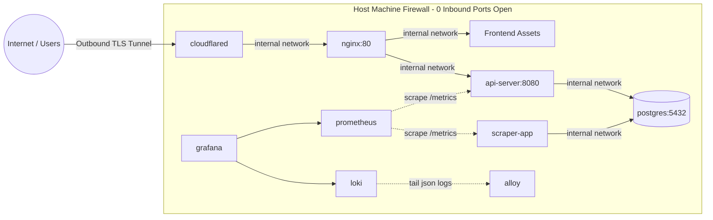

# BiH Power Alerts (SRE Portfolio Project)


A production-grade, highly available service that scrapes electricity outage schedules across utility providers in Bosnia and Herzegovina, maps them via OpenStreetMap Nominatim, and delivers proactive Web Push and bot notifications to users 2 hours before scheduled interruptions.

Built with a strong emphasis on **Site Reliability Engineering (SRE)** principles, including immutable infrastructure, automated testing, structured telemetry, and zero-trust perimeter networking.

---

## The Context

I built this because checking utility provider websites for scheduled maintenance is a tedious, manual process in Bosnia and Herzegovina. The data is often buried in unstructured HTML tables or scattered across different regional distributors.

What started as a simple Python script to scratch my own itch evolved into this project. I decided to use it as a sandbox to demonstrate how I approach production environments. Instead of just throwing a script on a VPS, I over-engineered the infrastructure to align with modern SRE practices: zero-trust networking, locked-down immutable containers, proper telemetry, and automated deployment pipelines. 

## Live Demo & Screenshots

**Live Application:** [outages.yourdomain.ba](https://outages.yourdomain.ba)

*(Note: Add your actual screenshots to a `docs/` folder and link them here before publishing)*
- **[Screenshot: Public PWA and Interactive Map UI]** - Shows the Leaflet heatmap and SRE stats banner.
- **[Screenshot: Grafana Observability Dashboard]** - Shows scraper latencies, active PostgreSQL connections, and the Loki log stream.
- **[Screenshot: Telegram Bot]** - Shows the automated dispatch message arriving 2 hours before a scheduled outage.

---

## System Architecture



---

## Infra and Security Highlights

- **Immutable Infrastructure:** Application containers run with `read_only: true` root filesystems backed by bounded `tmpfs` mounts to block runtime modification and malware persistence.
- **Least Privilege (PoLP):** Worker processes run under an unprivileged system user (`scraperuser`, UID 10001). Database port `5432` has zero host bindings.
- **Zero-Trust Edge Networking:** Inbound traffic terminates entirely through Cloudflare Tunnels via outbound long-lived connections. The host firewall exposes zero public listening ports.
- **Fault-Tolerant Scraping:** Resilient Regex parsing with automated regression tests prevents downstream ingestion panics on upstream table schema shifts.
- **Centralized Observability:** Fully instrumented with structured JSON logging (`python-json-logger`), Prometheus metrics endpoints, and centralized log aggregation via Grafana Loki.
- **Dynamic Proactive Dispatch:** Celery-free cron calculation triggers sub-two-hour notification windows directly against active database intervals.

---

## Usage Guide

For the end user, the system is designed to be completely frictionless. They do not need to download an app from an app store or create an account.

1. **The Web App (PWA):** Users visit the site, click their house on the interactive map (which reverse-geocodes their municipality and street via Nominatim), and click "Subscribe". Because of the included `manifest.json` and service worker, mobile users can install the site directly to their home screen as a native-feeling app.
2. **Telegram Bot:** Power users can message the bot `/subscribe Ulica, Broj, Grad`. The backend parses this, associates their Telegram Chat ID with the database, and routes future alerts directly to their phone.
3. **Automated Dispatch:** Once subscribed, the user does nothing. The `notification_service` runs quietly in the background and pushes an alert 2 hours before the utility company cuts their power.

---

## Rollout & Operations Guide

If you want to run this stack yourself, the rollout is fully automated.

**Infrastructure Provisioning:**
The base server infrastructure is managed via Terraform, targeting a standard Linux VPS. It provisions the compute instance, configures UFW to block all inbound traffic (except SSH), and prepares the Docker environment. 

**Configuration Management:**
Ansible handles the host-level configuration. It installs the Docker daemon, sets up the restrictive user groups, pulls the repository, injects the `.env` secrets, and brings up the Docker Compose stack. 

**Disaster Recovery & Monitoring:**
Because web scrapers are inherently fragile (utility companies change their DOM structures without warning), the observability stack is critical. If a scraper fails, it does not take down the API. Instead:
1. The error is caught and logged as a structured JSON event.
2. Promtail/Alloy ships the log to Loki.
3. Prometheus detects the drop in the `outages_collected` metric.
4. Grafana fires an alert directly to the admin's Telegram channel so the regex can be patched before the next scheduled run.

---

## Getting Started

### Prerequisites
- Docker Engine 24.0+ & Docker Compose
- Cloudflare Tunnel Token
- VAPID Public/Private Keypair

### Deployment
1. **Clone the repository:**
   ```bash
   git clone [https://github.com/USERNAME/REPO_NAME.git](https://github.com/USERNAME/REPO_NAME.git)
   cd REPO_NAME
   ```

2. **Configure secrets:**
   ```bash
   cp .env.example .env
   chmod 600 .env
   ```
   (Add your VAPID keys, secure Postgres passwords, and Cloudflare tokens to your `.env`)

3. **Deploy the stack:**
   ```bash
   docker compose up -d --build
   ```

---

## Testing
Run unit and regression suites:
```bash
docker exec -it outage-api python -m pytest tests/ -v
```

There are also pytests included in the CI workflow, and the Terraform/Ansible configurations are located in their respective directories should you want to provision remote infrastructure. The code is linted formatted with black, imports sorted nicely with isort and linted after with flake8. I opted to not use pylint, because .pylintrc would be very big and frankly, I'd love to shadow a senior first to learn proper lining architectural choices than to make up my own which might be wrong.

Good luck! Thanks for reading.
