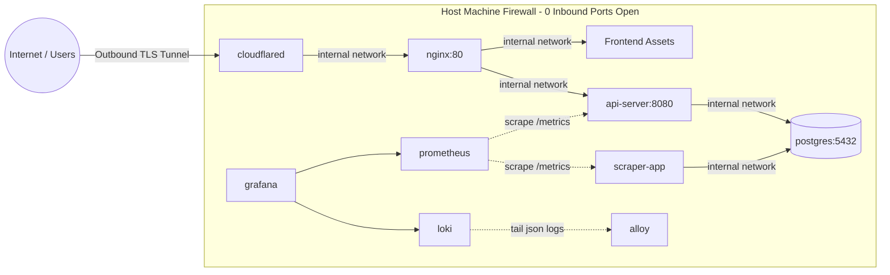

# BiH Power Alerts (SRE Portfolio Project)


A production-grade, highly available service that scrapes electricity outage schedules across utility providers in Bosnia and Herzegovina, maps them via OpenStreetMap Nominatim, and delivers proactive Web Push and bot notifications to users 2 hours before scheduled interruptions.

Built with a strong emphasis on **Site Reliability Engineering (SRE)** principles, including immutable infrastructure, automated testing, structured telemetry, and zero-trust perimeter networking.

---

## System Architecture



---

## Infra and Security Highlights

* **Immutable Infrastructure:** Application containers run with `read_only: true` root filesystems backed by bounded `tmpfs` mounts to block runtime modification and malware persistence.
* **Least Privilege (PoLP):** Worker processes run under an unprivileged system user (`scraperuser`, UID 10001). Database port `5432` has zero host bindings.
* **Zero-Trust Edge Networking:** Inbound traffic terminates entirely through Cloudflare Tunnels via outbound long-lived connections. The host firewall exposes zero public listening ports.
* **Fault-Tolerant Scraping:** Resilient Regex parsing with automated regression tests prevents downstream ingestion panics on upstream table schema shifts.
* **Centralized Observability:** Fully instrumented with structured JSON logging (`python-json-logger`), Prometheus metrics endpoints, and centralized log aggregation via Grafana Loki.
* **Dynamic Proactive Dispatch:** Celery-free cron calculation triggers sub-two-hour notification windows directly against active database intervals.

---

## Getting Started

### Prerequisites
* Docker Engine 24.0+ & Docker Compose
* Cloudflare Tunnel Token
* VAPID Public/Private Keypair

### Deployment
1. **Clone the repository:**
   ```bash
   git clone [https://github.com/USERNAME/REPO_NAME.git](https://github.com/USERNAME/REPO_NAME.git)
   cd REPO_NAME
   ```

2. **Configure secrets:**
   ```bash
   cp .env.example .env
   chmod 600 .env
   ```
   (Add your VAPID keys and secure Postgres passwords and else to your .env)

3. **Deploy the stack:**
   ```bash
   docker compose up -d --build
   ```

---

## Testing
Run unit and regression suites:
```bash
docker exec -it outage-api python -m pytest tests/ -v
```

There's also some pytests included in CI, there's also Ansible and Terraform should you want to use this.

Good luck! Thanks for reading :)
