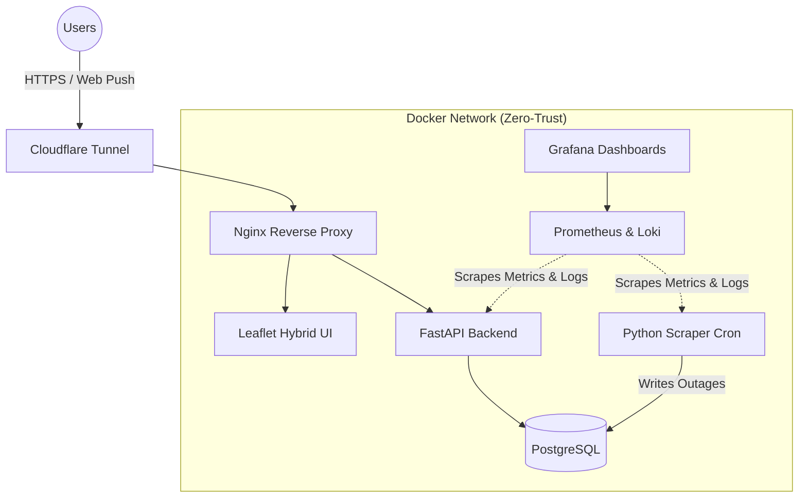

# BiH Power Alerts (SRE Portfolio Project)


A production-grade, highly available service that scrapes electricity outage schedules in Bosnia and Herzegovina, maps them via OpenStreetMap Nominatim, and delivers proactive Web Push notifications to users 2 hours before their power goes out.

Built with a strong emphasis on **Site Reliability Engineering (SRE)** principles, including immutable infrastructure, automated testing, structured telemetry, and zero-trust networking.

##System Architecture



## ecurity Highlights

1. **Immutable Infrastructure:** Containers (`api-server`, `scraper-app`) run with `read_only: true` filesystems and strict `tmpfs` mounts to prevent remote code execution (RCE) payload persistence.
2. **Least Privilege (PoLP):** Containers execute as a dedicated, non-root `scraperuser`. Database ports (5432) are deliberately removed from the host binding to prevent lateral network traversal.
3. **Zero-Trust Ingress:** Total isolation from the public internet using Cloudflare Tunnels. No open ports on the host machine firewall.
4. **Resilient Data Parsing:** Custom Regex/Address-matching engine backed by an automated `pytest` suite to handle highly inconsistent Bosnian municipal address formats.
5. **Observability Stack:** Fully instrumented with structured JSON logging (`python-json-logger`), Prometheus metrics, and Grafana Loki for centralized log aggregation.
6. **Smart Alerting:** Scheduled cron jobs calculate `T-Minus 2 Hours` logic locally without relying on heavy database polling, firing Web Push payloads dynamically.

## Getting Started

### Prerequisites
- Docker & Docker Compose
- Cloudflare Tunnel Token (for ingress)
- VAPID Keys (for Web Push)

### Deployment
1. Clone the repository:
   ```bash
   git clone [https://github.com/USERNAME/REPO_NAME.git](https://github.com/USERNAME/REPO_NAME.git)
   cd REPO_NAME
   ```
2. Configure your environment:
   ```bash
   cp .env.example .env
   # Add your VAPID keys and secure Postgres passwords
   ```
3. Boot the immutable stack:
   ```bash
   docker compose up -d --build
   ```

## Testing
The core address-matching logic is rigorously tested. To run the suite:
```bash
docker exec -it outage-api python -m pytest tests/ -v
```
or use Github Actions CI.
